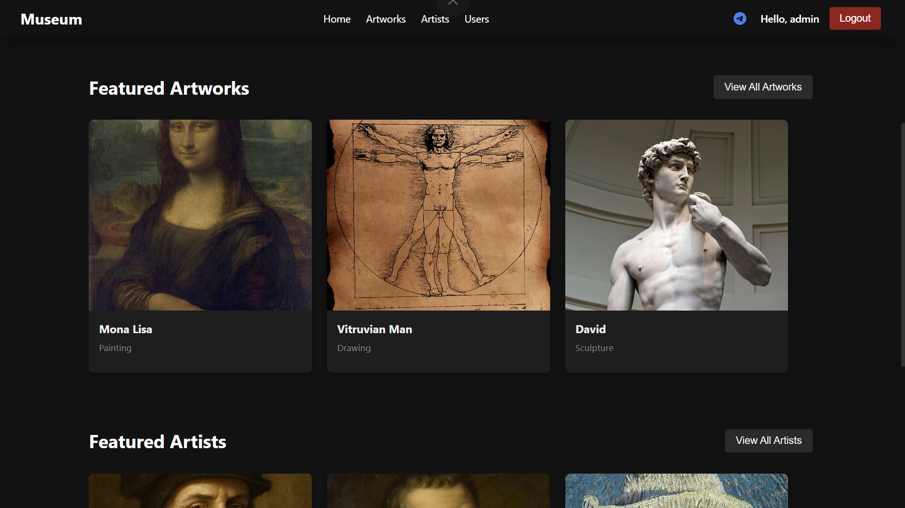
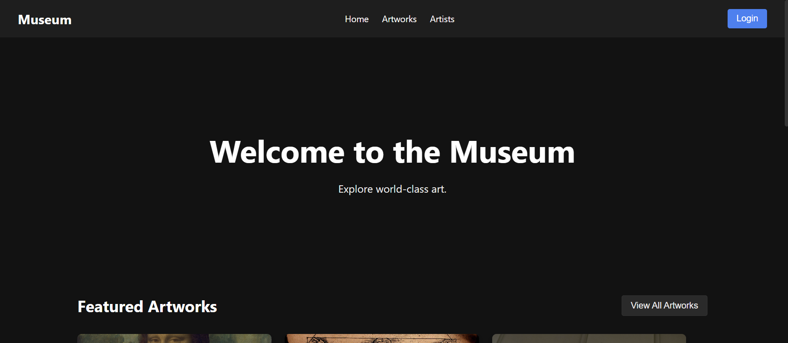
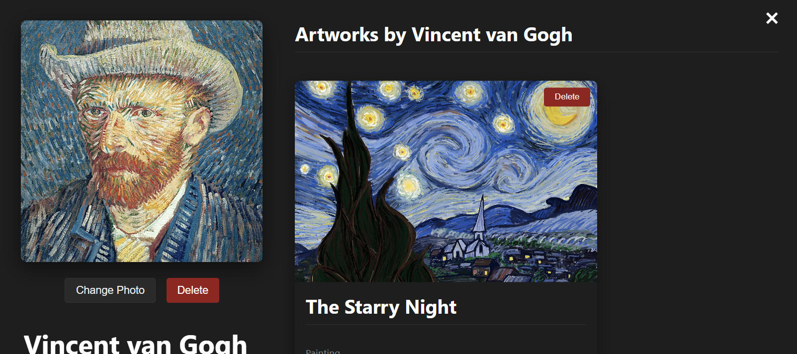
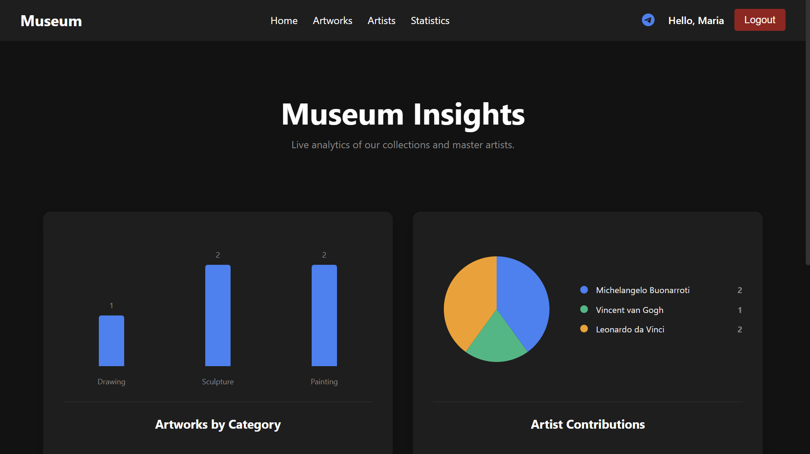
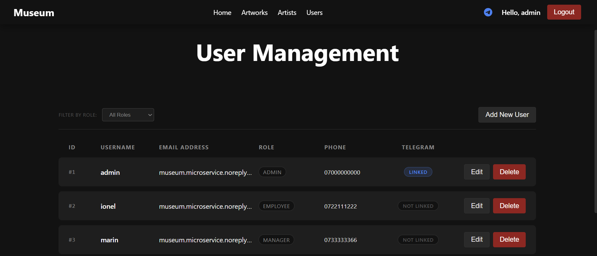
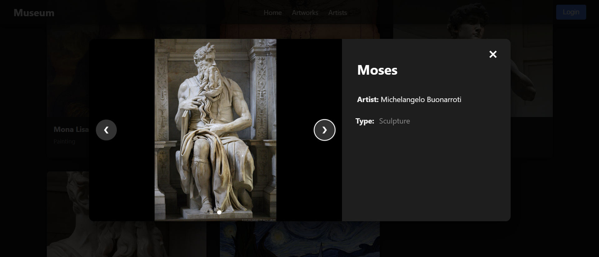

# Museum Microservices

<div align="center">
  <a href="https://www.oracle.com/java/">
    
  </a>
  <a href="https://spring.io/projects/spring-boot">
    
  </a>
  <a href="https://spring.io/projects/spring-cloud-gateway">
    
  </a>

  <a href="https://react.dev/">
    
  </a>

  <a href="https://www.sqlite.org/">
    
  </a>
  <a href="https://min.io/">
    
  </a>

  <a href="https://www.docker.com/">
    
  </a>

  <a href="https://jwt.io/">
    
  </a>
</div>

A museum management system built using a microservice architecture focused on modularity and independent service scaling. The backend is implemented in **Java** with **Spring Boot**, while the frontend uses **React**. Services communicate via **REST APIs** and follow a database-per-service approach using **SQLite**, while media assets are managed through **MinIO** object storage. Authentication is handled via **JWT**, with role-based access control securing protected endpoints. The platform also integrates **Telegram** and **email** notifications, with full containerization handled by **Docker**.

<div align="center" style="display: flex; flex-direction: column; gap: 10px;">
  <div style="display: flex; justify-content: center; gap: 10px; flex-wrap: wrap;">
    
    
    

  </div>
  <div style="display: flex; justify-content: center; gap: 10px; flex-wrap: wrap;">
    
    
    

  </div>
</div>

>Note: Additional screenshots of the interface and features can be found in the <a href="screenshots">screenshots</a> directory.

## Architecture & Stack

The system follows a **Database-per-Service** approach to ensure total decoupling and independent scalability.

*   **API Gateway:** Powered by **Spring Cloud Gateway**, acting as the single entry point for the React frontend and routing traffic to internal services.
*   **Microservices:** Consists of 7 independent **Spring Boot 3.4** services exposing dedicated **REST endpoints** to orchestrate the platform's core features while remaining scalable and decoupled.
*   **Security:** Stateless authentication using **JWT**, securing all inter-service and client communication.
*   **Storage:** A hybrid approach using **SQLite** for lightweight relational data and **MinIO** for S3-compatible object storage (handling all high-res artwork and artist photos).
*   **Frontend:**  A high-performance **React 19** Multi-Page Application (MPA) built with **Vite** and styled with **Vanilla CSS**, served via **Nginx**.

## Features by Role

### Visitor (Public Access)
*   **Art Gallery:** View the museum collection with 1-3 high-res images per artwork.
*   **Artist Profiles:** Detailed profiles including name, birth date/place, nationality, photo, and their full collection within the museum.
*   **Discovery:** Filtering (by artist, type, etc.) and search by title or artist name.
*   **Multilingual UI:** Interface available in multiple languages.
*   **Telegram Integration:** Link your account to the Museum Bot for real-time mobile alerts.
*   **Account Features: (After Login)** Link a Telegram Bot for real-time security alerts and receive email notifications for any password changes.

### Employee
*   *Includes all Visitor features, plus:*
*   **Inventory Management:** Full CRUD operations for artworks and artists.
*   **Data Export:** Save artwork lists in multiple formats: CSV, JSON, XML, and DOC.

### Manager
*   *Includes all Employee features, plus:*
*   **Visual Analytics:** Access to dashboards showing key museum statistics via charts and graphs.

### Administrator
*   *Includes all Visitor features, plus:*
*   **User Management:** Full CRUD operations for all system users.
*   **Security Notifications:** Automated alerts via 2 channels (email and Telegram) whenever a user's password is modified.

## Getting Started
### Prerequisites

* [Docker](https://www.docker.com/get-started) and Docker Compose
* Telegram Bot Token ([@BotFather](https://t.me/botfather))
* SMTP credentials for email

### Installation

1. **Clone the repository:**
   
```bash
   git clone https://github.com/iPanda64/museum-microservices.git
   cd museum-microservices
```
2. **Configure Environment Variables:**
Copy the example environment file and update it with your credentials:
*   **Linux/macOS:**
    
```bash
    cp .env.example .env
```
*   **Windows (Command Prompt):**
    
```cmd
    copy .env.example .env
```
>Note: You must at least set JWT_SECRET, TELEGRAM_BOT_TOKEN, TELEGRAM_BOT_NAME, and SMTP settings for all services to function correctly.

### Running the Application

Start the application using Docker Compose:

```bash
docker compose up -d --build
```
Once the containers are running, you can access the app at [http://localhost](http://localhost)

## Default Login Credentials

For testing or initial use, you can log in with the following accounts:

| Role       | Username | Password |
|------------|----------|----------|
| Admin | admin | password |
| Employee    | Jay | ionel |
| Manager  | Maria | maria |
| Visitor | Michael | mihai123 |

> All accounts are stored in the SQLite database. You can create or modify users through the User Management interface.
